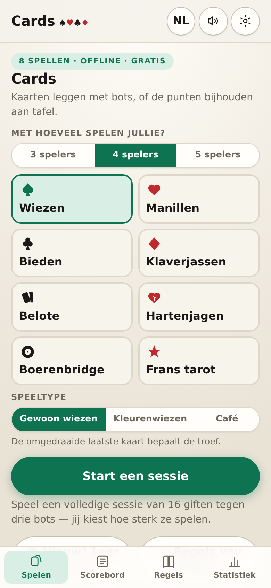
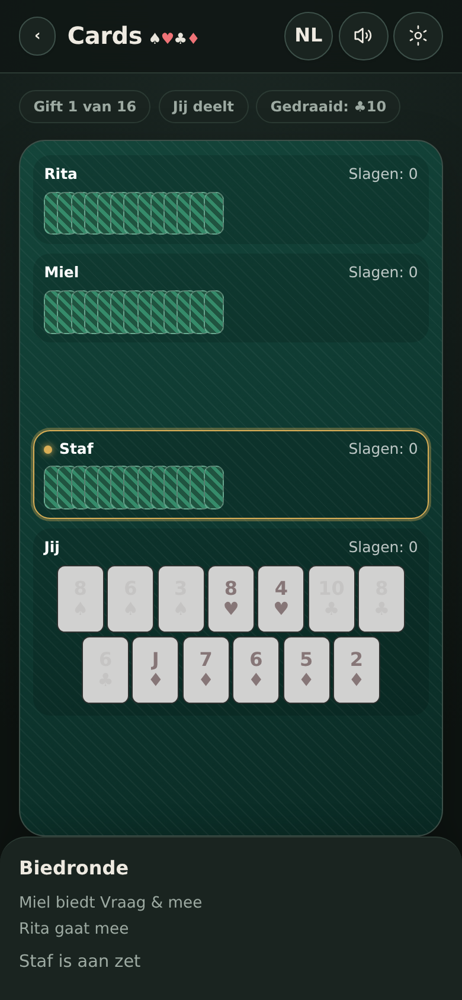
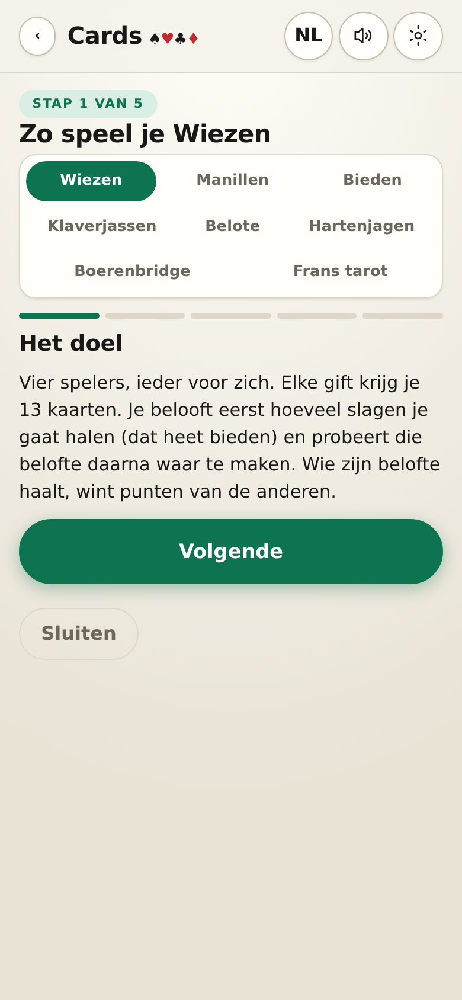
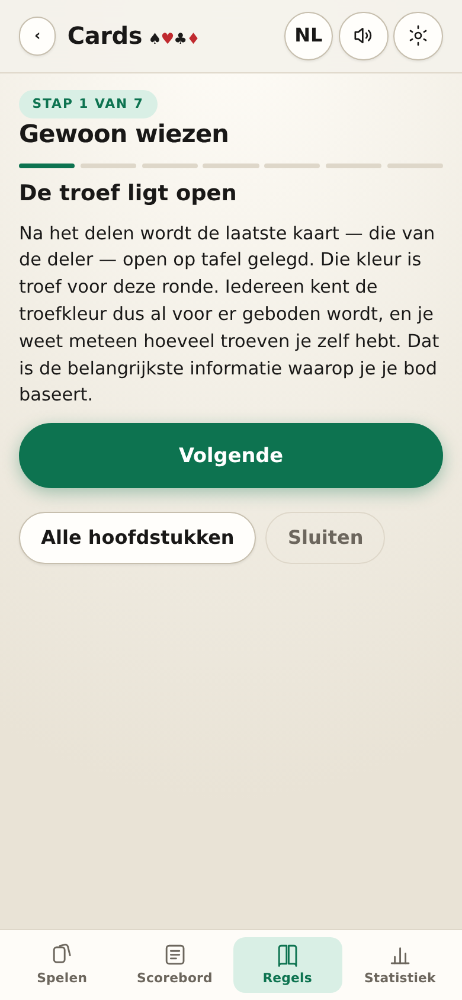
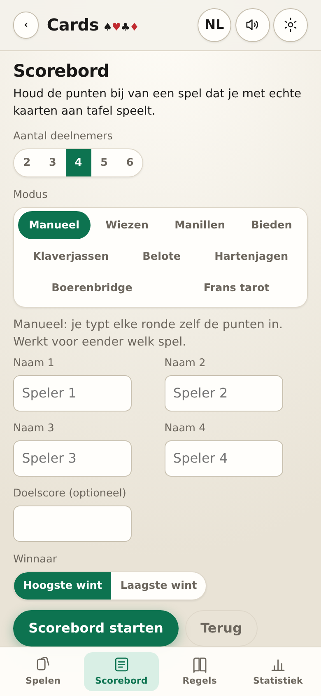
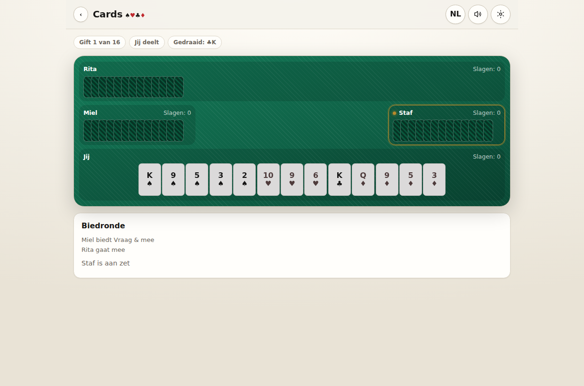
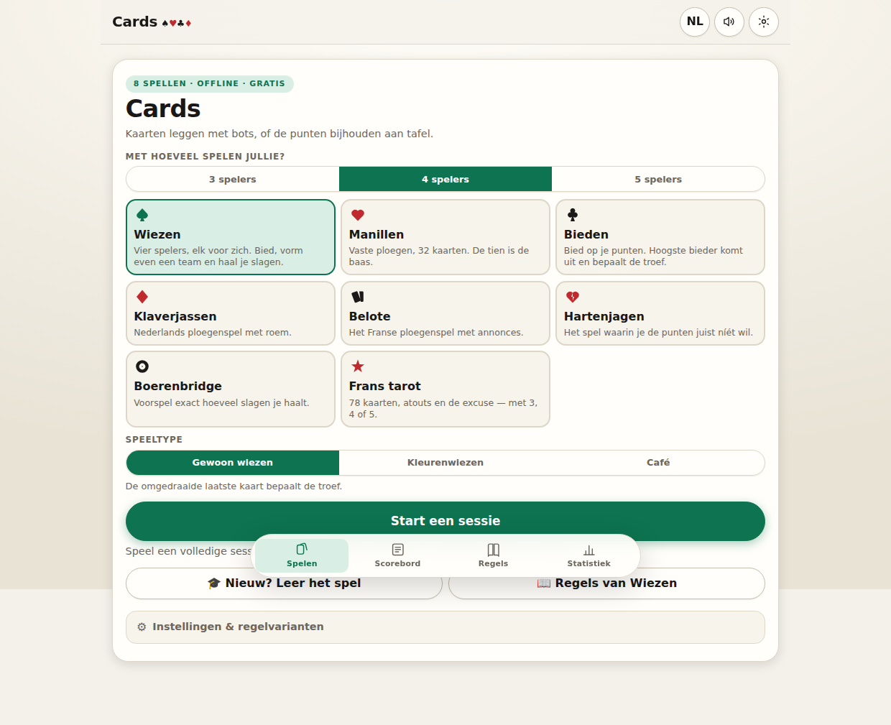
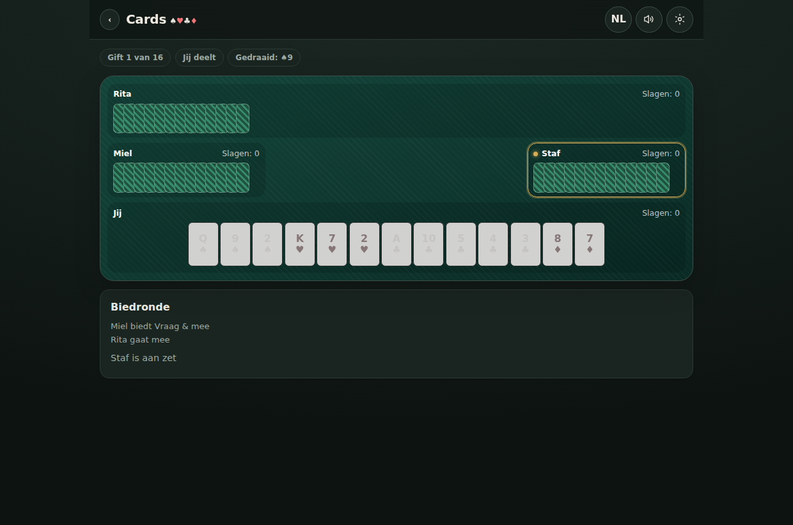

# Cards

**Vlaamse kaartspellen in je browser.** Wiezen, manillen en bieden tegen drie bots —
plus een scorebord voor als je aan tafel met echte kaarten speelt. Geen account, geen
reclame, werkt offline en is installeerbaar op je gsm.

▶️ **Speel op [mityjohn.com/cards](https://mityjohn.com/cards/)**

|                                                          Startscherm                                                          |                                                  Aan tafel                                                  |
| :---------------------------------------------------------------------------------------------------------------------------: | :---------------------------------------------------------------------------------------------------------: |
|  |  |

|                                           Starterswizard                                            |                                                 Regels & uitleg                                                  |
| :-------------------------------------------------------------------------------------------------: | :--------------------------------------------------------------------------------------------------------------: |
|  |  |

|                                                   Scorebord                                                   |                                       Aan tafel op desktop                                       |
| :-----------------------------------------------------------------------------------------------------------: | :----------------------------------------------------------------------------------------------: |
|  |  |

<details>
<summary>Meer beelden (desktop, licht &amp; donker)</summary>





</details>

## Wat zit erin

- **Acht spellen, negen speeltypes** — wiezen in twee vormen: **gewoon wiezen** (de
  omgedraaide laatste kaart is troef) en **kleurenwiezen** (wie vraagt, noemt zelf de
  troefkleur); daarnaast manillen (vaste ploegen, de tien is de baas), bieden (bod in
  punten, hoogste bieder bepaalt de troef), **klaverjassen** (het Nederlandse
  ploegenspel, met roem en de keuze tussen Rotterdams en Amsterdams tellen),
  **belote** (het Franse ploegenspel, met annonces uit de hand en belote-rebelote) en
  **hartenjagen** (ieder voor zich, geen troef — en de punten wil je juist níét) en
  **boerenbridge** (voorspel exact je aantal slagen; de handgrootte wisselt elke ronde) en
  **Frans tarot** (een eigen spel van 78 kaarten met atouts en de excuse, met 3, 4 of 5
  spelers, volgens het officiële FFT-reglement — met de varianten als keuze bij de start).
- **Regelvarianten kies je bij de start** — troel op 8 of 9 slagen, manille op 60 of
  68 punten, enzovoort. De regels staan gedocumenteerd in
  [`../docs/REGELS.md`](../docs/REGELS.md) en machineleesbaar in
  [`../rulesets/`](../rulesets).
- **Coach, starterswizard én regelgids** — ken je het spel niet? De wizard legt het in
  vier à vijf schermen uit, de **regelgids** loodst je in elf hoofdstukken stap voor
  stap door álle regels (basis, gewoon wiezen, kleurenwiezen, manillen, bieden, belote,
  klaverjassen, hartenjagen, boerenbridge, tarot, scorebord), en
  de coach geeft tijdens het spel tips bij wat je nu moet doen.
- **Scorebord voor een fysiek spel** — hou de stand bij aan tafel. Elk spel heeft een
  **automodus**: duid aan wat er gebeurde en de app rekent de punten uit, met dezelfde
  scorefuncties als het spel zelf. Welke spellen je kan kiezen hangt af van het aantal
  deelnemers, en dat aantal kan je ook op een lopend bord nog wijzigen — schuift er
  iemand aan of stopt iemand ermee, dan past de lijst zich meteen aan.
- **App-schil in plaats van een lange pagina.** Onderaan een tabbalk (Spelen ·
  Scorebord · Regels · Statistiek) die overal met de duim bereikbaar is. In de kop
  staat de **taalkeuze als eigen knop met de actieve code erop** (NL / EN / FR) —
  achter het tandwiel zat ze verstopt, en dat is net de instelling die je moet
  kunnen vinden als de app in een taal opstart die je niet leest. Het tandwiel
  houdt het thema. Aan de speeltafel verdwijnt de tabbalk en blijft het
  actiepaneel onderaan staan, zodat je nooit moet scrollen om te bieden of een
  kaart te leggen.
- **Eén geometrische tekenset.** Elk spel heeft een getekend teken in dezelfde
  meetkunde — de vier kleuren waar ze horen, en voor de andere vier een teken uit
  dezelfde familie (twee kaarten, een gebarsten hart, een roos, een ster). Rood
  en zwart zoals aan een echte tafel; op de gekozen tegel neemt het zwarte teken
  de accentkleur over.
- **Kies eerst met hoeveel je bent** (3, 4 of 5) — het startscherm toont dan enkel
  de spellen die de app met dat aantal kan delen. Met drie of vijf is dat Frans
  tarot; de andere spellen delen vier handen.
- **Drie botniveaus**, statistieken, animaties en geluid.
- **Nederlands, Engels en Frans**, licht/donker/systeemthema, en alles blijft lokaal
  in `localStorage` — er vertrekt geen data naar een server.

## Als app op je gsm

Cards is een PWA: geen App Store, geen installatiebestand, gewoon de pagina op je
beginscherm zetten. Daarna start hij schermvullend en werkt hij offline.

Zodra je browser laat weten dat installeren kan, verschijnt er bovenaan het
startscherm een balk met **Installeren** — één tik en het venster van de browser
staat er. Wie hem wegklikt met _Niet nu_ krijgt hem niet meer terug; de knop
**Als app installeren** onderaan blijft wel staan. Allebei verdwijnen ze zodra je
de app effectief vanaf je beginscherm opent.

- **Chrome, Edge, Android** — de balk en de knop openen het echte
  installatievenster van de browser (via `beforeinstallprompt`).
- **iPhone / iPad** — open <https://mityjohn.com/cards/> in **Safari**, tik op het
  deelicoon en kies **Zet op beginscherm**. iOS heeft geen installatie-API, dus
  daar tonen de knoppen enkel die uitleg. Andere browsers op iOS tonen het
  deelmenu soms zonder die keuze; Safari doet het altijd.

Twee dingen om te weten op iOS: een app op het beginscherm heeft zijn **eigen opslag**,
los van Safari, dus je scoreborden en statistieken uit de browser verhuizen niet mee.
En een nieuwe versie komt binnen zodra je de app opent — hij kijkt bij elke keer
terugkeren of er een update klaarstaat en herlaadt dan één keer.

## Structuur

```
cards/                  # deze app (Vite + TypeScript, strict)
├── index.html          # app-shell (anti-flits themascript)
├── scripts/
│   └── screenshots.mjs # genereert docs/screenshots/ voor README en release notes
├── docs/screenshots/   # gegenereerde beelden (mobiel + desktop, licht + donker)
├── src/
│   ├── main.ts         # UI: tafel, biedronde, wizard, scorebord, rendering
│   ├── engine/         # DOM-vrije engines: wiezen, manillen, bieden, klaverjassen,
│   │                   #   belote, hartenjagen, boerenbridge, tarot (eigen kaartset)
│   ├── bots.ts         # heuristische botspelers (drie niveaus)
│   ├── coach.ts        # starterswizard-stappen + contextuele tips
│   ├── guide.ts        # regelgids: hoofdstukken en stappen per speltype
│   ├── scorebord*.ts   # scorebord voor fysiek spel (automodus per spel)
│   ├── options.ts      # regelvarianten per sessie
│   ├── store.ts        # persistentie via actielog + replay
│   ├── i18n/           # nl / en / fr, nl = fallback
│   ├── theme.ts        # licht / donker / systeem
│   ├── ruleset.ts      # laadt rulesets/*.json (repo-niveau)
│   └── **/*.test.ts    # Vitest
├── vite.config.ts      # base: /cards/
└── eslint.config.js    # ESLint + typescript-eslint; Prettier voor formattering
```

## Commando's

| Commando              | Doel                                                      |
| --------------------- | --------------------------------------------------------- |
| `npm run dev`         | dev-server                                                |
| `npm run build`       | typecheck + productiebuild naar `dist/`                   |
| `npm run test`        | Vitest (engines, bots, i18n, thema, ruleset, scorebord)   |
| `npm run lint`        | ESLint + Prettier-check                                   |
| `npm run format`      | Prettier write                                            |
| `npm run screenshots` | vernieuwt `docs/screenshots/` (vereist een verse `dist/`) |

## i18n & thema

- **Talen:** `nl` (standaard/fallback), `en`, `fr`. Berichten in `src/i18n/locales/*.json`;
  sleutelpariteit wordt door een test afgedwongen. Keuze persistent in `localStorage`
  (`cards.lang`), `<html lang>` volgt.
- **Thema:** licht / donker / systeem via `data-theme` op `<html>` en CSS custom properties;
  persistent in `localStorage` (`cards.theme`), een inline script in `index.html` voorkomt
  een themaflits bij het laden.

## Screenshots & releases

`npm run screenshots` start de gebouwde app in een lokale Chromium en legt vijf scènes
vast (startscherm, wizard, spel, regelgids, scorebord) × mobiel/desktop × licht/donker. De beelden
in deze README komen daar rechtstreeks uit, en horen ook in elke release note — zie
[`../RELEASING.md`](../RELEASING.md).

## Deploy

De workflow `.github/workflows/deploy.yml` bouwt de Astro-site én deze app en kopieert
`cards/dist` naar `dist/cards`, zodat alles in één GitHub Pages-deploy live gaat.
CI (`ci.yml`) draait lint, tests en build voor elke pull request.
